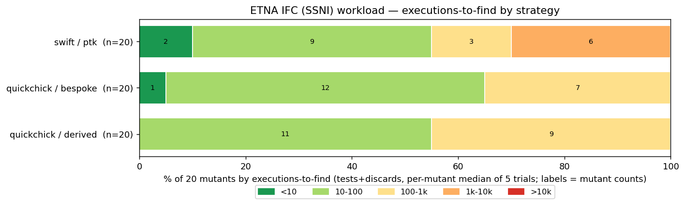
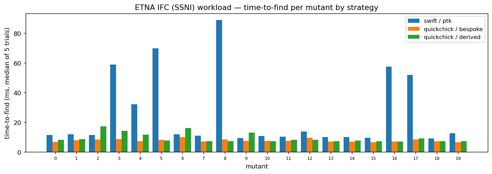

# etna-swift-ifc

An **information-flow-control (IFC) noninterference workload for
[ETNA](https://github.com/alpaylan/etna-cli)**, implemented in **Swift** with
**[PropertyTestingKit](https://github.com/doordash-oss/PropertyTestingKit)**
(PTK) as a **coverage-guided** testing strategy.

It is a faithful port of the **QuickChick `ifc-basic`** machine (Hriţcu et al.,
*Testing Noninterference, Quickly*) — the same abstract stack machine ETNA's
Rocq/IFC workload derives from: the same two-point-label `Atom`/`Stack`/`State`,
the same seven instructions, the same rule `table` and `exec` step, the same
`indist`, the same single-step noninterference (**SSNI**) property, and the same
**generated** mutant set. The novelty is the **strategy**: PTK drives the search
with **edge-coverage feedback** over a bespoke variation generator.

This is the sixth Swift/PTK ETNA workload, after
[bst](https://github.com/twof/etna-swift-bst),
[rbt](https://github.com/twof/etna-swift-rbt),
[stlc](https://github.com/twof/etna-swift-stlc),
[fsub](https://github.com/twof/etna-swift-fsub), and
[luparser](https://github.com/twof/etna-swift-luparser). Where those are
data-structure-invariant, type-preservation, or parser round-trip workloads,
this one is a **security property**: an input is a *variation* — a pair of
machine states that agree on low (public) data — and the property says one step
of the machine keeps them indistinguishable. A bug is an information leak.

## The workload

- **Machine** (`Machine.swift`): values are `Atom`s (an `Int` tagged with a
  label `L`/`H`); a `State` is instruction memory, data memory, an operand
  `Stack`, and a PC atom. `exec` is one step; a rule `Table` decides, per
  opcode, whether the step is allowed and how labels propagate. `defaultTable`
  is the noninterference-correct table.
- **Rules** (`Rules.swift`): the two-point lattice, label expressions
  (`L_Bot`/`L_Var`/`L_Join`), side conditions (`A_True`/`A_LE`/`A_And`/`A_Or`),
  and rule evaluation. (Coq's dependently-typed `LAB n` becomes a plain enum;
  range-correctness is an invariant `defaultTable` holds and `mutateTable`
  preserves.)
- **Indistinguishability** (`Indist.swift`): `indist` on atoms, memory, stacks
  (with `cropTop`), and states.
- **Property** (`Spec.swift`): `propSSNI(table, variation) -> Bool?` — `nil`
  discards a variation that is not indistinguishable or whose step faults;
  `true`/`false` is the post-step indistinguishability verdict.
- **Mutants** (`Mutate.swift`): **20**, *generated* rather than hand-written —
  see below.

### Mutants are generated, not source-swapped

Unlike the tree / STLC / parser workloads (which use ETNA's marauder
source-swap), IFC mutants are **data**. `mutateTable(defaultTable)` enumerates
every single-disjunct weakening of the rule table — one dropped side-condition
conjunct, or one dropped disjunct from a result-label or PC-label join, per
opcode — yielding exactly **20 mutant tables** (verified identical in count and
order to the Coq reference). Each is a strictly weaker propagation rule for one
opcode, so it leaks. A mutant is selected by **index** (`ifc ptk SSNI <secs>
<n>`), and the clean table is the default. This mirrors the reference, whose
`MutateCheck` also runs over `mutate_table default_table` rather than over
source variants (the reference IFC `etna.toml` has no `[[tasks]]` for the same
reason).

### Differential validation against the Coq reference

The port is validated against the independent QuickChick reference with a
**differential oracle** (`oracle/coq-ifc/`). The Swift `ifc-oracle` generates a
corpus of variations and emits BOTH (a) its own SSNI verdict for each variation
under the clean table *and all 20 mutant tables* (a 21-character T/F/D string
per variation) and (b) a Coq program that reconstructs the *same* variations as
`ifc-basic` terms and prints the same verdict strings. Compiling the reference
machine + that program and diffing the two outputs cross-checks `exec`,
`indist`, SSNI, and `mutateTable` (every mutant, by column) in one shot:

```bash
./oracle/coq-ifc/run.sh 3000
# OK: 3007 variations, all 21 verdict columns (clean + 20 mutants) identical Swift vs Coq
```

Verified: **0 mismatches across 3,007 variations × 21 tables**, with the corpus
exercising all three verdict kinds (≈3.5k `T`, ≈5k `D` discards, and the `F`
columns where mutants are killed). Coq independently confirms `mutate_table`
length = 20.

### The generator

`Sources/IFCGen/Generators.swift` ports the reference's bespoke generator
(`Generation.v`): `genState` builds a random well-formed state (favouring
`Store`, the most interesting opcode), and `varyState` produces a low-equivalent
partner by re-randomising only high-labelled data — so a generated *variation*
passes SSNI's indistinguishability precondition most of the time (≈87%; the rest
are discarded, as in the reference). PTK layers edge-coverage feedback, a seed
set of known witnesses, and structural mutation on top.

## Benchmark

Cross-engine comparison over the **20 mutants**, 5 trials each, executions-to-
find counted identically for both engines (`tests + discards` = variations run
before the counterexample). swift/ptk runs a **single** engine so its execution
count is single-threaded and comparable to QuickChick. IFC has no Rust/Haskell
port; the reference's strategies are QuickChick's two generators.

| Strategy | Solved | Executions-to-find (median / max) | Time-to-find (median / max) |
|---|---:|---|---|
| swift / ptk | **20/20** | 86 / **7223** | 11.7ms / 88.8ms |
| quickchick / bespoke (`gen_variation_state`) | 20/20 | 68 / 248 | 7.4ms / 10.0ms |
| quickchick / derived (`gen_variation_state_derived`) | 20/20 | 90 / 674 | 8.0ms / 17.3ms |

**All three strategies solve all 20 mutants**, and on the *median* mutant they
are in the same ballpark (68–90 executions). The honest finding here is a
**negative result for coverage guidance**:

- **PTK has a much worse tail.** Its hardest mutants need up to ~7,200
  executions; QuickChick never exceeds ~250 (bespoke) / ~675 (derived). PTK puts
  6 of 20 mutants in the 1k–10k bucket; QuickChick puts none above 100–1k.
- **PTK is the slowest on wall-clock**, as on the other workloads — coverage
  instrumentation plus the corpus-mutation machinery is overhead here.

Why coverage doesn't help: SSNI is a **data** property. A leak is witnessed by a
variation whose two states *disagree on low data after one step* — but reaching
that input does not light up any *new edge* in `exec` (the same instruction runs
either way). So the coverage signal is uninformative for this property, the
feedback loop gives PTK nothing to climb, and its search is effectively random
sampling of the same generator **plus** overhead and a longer tail. This is the
opposite of [luparser](https://github.com/twof/etna-swift-luparser) (where PTK
had the *tightest* tail) and of [stlc](https://github.com/twof/etna-swift-stlc) /
[fsub](https://github.com/twof/etna-swift-fsub) (where a type/structure-directed
generator is the whole game). Different workload, different verdict — which is
the point of running it.





Caveat (as with the prior ports): swift/ptk and QuickChick/bespoke use the *same*
generator family, so this isolates *search strategy over a shared generator*, not
generator quality; and on a workload where every strategy saturates, the
interesting axis is the cost of the search, not the solve rate.

## Layout

| Path | Role |
|---|---|
| `Sources/IFC/` | System under test: `Rules.swift`, `Machine.swift` (`exec`, `defaultTable`), `Indist.swift`, `Mutate.swift` (the 20 mutants), `Spec.swift` (SSNI), `Wire.swift` (counterexample + Coq-term serialization). Instrumented with `-sanitize-coverage`. |
| `Sources/IFCGen/` | PTK-backed bespoke variation generator + coverage-guided `solve` / `sample`. |
| `Sources/Solve/` | The `ifc` executable (ETNA `solve`). Dir is `Solve` to dodge a case-insensitive-filesystem clash with `IFC`. |
| `Sources/ifc-sampler/` | The `ifc-sampler` executable (ETNA `sample`). |
| `Sources/ifc-oracle/` | Differential-oracle helper: emits Swift verdicts + a Coq program over a shared variation corpus. |
| `Tests/IFCTests/` | Mutant count (=20), one-opcode-difference, clean SSNI, generator indistinguishability, and all-20-mutants-killed. |
| `oracle/coq-ifc/` | The Coq reference machine + `run.sh` differential oracle. |
| `bench/` | The cross-engine benchmark (`run-bench.sh`) + chart script (`charts.py`). |

## Building & running

PTK requires the **patched Swift toolchain** (parameter packs) and **macOS 26**,
so build via the wrapper rather than system `swift`:

```bash
export BUILD_ROOT=/path/to/OpenSourceDev/build/Ninja-RelWithDebInfoAssert
./scripts/swift-toolchain.sh build      # builds ifc + sampler + oracle
./scripts/swift-toolchain.sh test       # machine / mutant / generator tests
```

`Package.swift` depends on PropertyTestingKit via the relative path
`../PropertyTestingKit`, so the PTK checkout must sit beside this workload.

```bash
# ifc <strategy> <property> [seconds] [mutant_index]   (strategy: "ptk")
./scripts/run-ifc.sh ptk SSNI 10        # clean table — passes
./scripts/run-ifc.sh ptk SSNI 10 16     # mutant 16 — finds a leak
```

The Coq oracle and benchmark require the `etna-coq` opam switch (Coq 8.15 +
QuickChick 2.2); both scripts activate it themselves.
